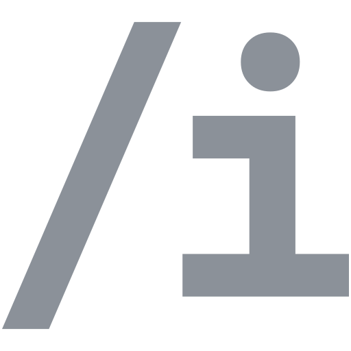

<div align="center">



# Thei

**🗃️ Digital archive of your life — projects, pages and a timeline of a life.**

</div>

**Thei** is a Nuxt layer you install on your own server. It gives one person a
place to keep everything they make and everything that happens: projects with
their stages, standalone pages, dated events, files. All of it lands on a single
continuous timeline, and all of it stays on a machine you control.

## What is inside

- **Life** — one timeline of everything dated: events, project stages, pages,
  avatar and status changes. **Rewind** shows this same day in previous years.
- **Projects** — stages, sections, media, external links, related entities, tags.
- **Pages, events and tags** — standalone writing and the threads between it.
- **Block editor** — Editor.js with content snapshots, so nothing is lost.
- **Media library** — content-addressed storage with deduplication and reuse
  tracking, image and video derivatives via sharp and ffmpeg, uploads streamed
  to disk up to 500 MB.
- **Access levels** — the whole site open or closed, and every project, event,
  page and file public, link-only or private on its own.
- **Admin panel** — settings, visuals (theme, accent colour, font), multilanguage interface, one-click updates.

## Install

On a fresh Debian or Ubuntu server, as root:

```bash
bash <(curl -fsSL https://raw.githubusercontent.com/Gwynerva/thei/main/update/install.sh)
```

It installs the runtimes, sets up `/opt/thei` at the newest release, builds it
and starts it as a systemd service on `127.0.0.1:3000`. Then open the address it
prints — the setup wizard runs in the browser. Put nginx in front of it for a
domain and TLS.

Requirements: systemd, 2 GB of RAM, a few GB of disk.

→ [Installing, updating, backups and migrations](update/README.md)

## Updating

**Updates** in the admin panel checks for a newer release and installs it on one
click. The old build keeps serving while the new one compiles, database
migrations run on the way back up, and the previous build is kept for rollback.

## Backups

`content/` is the only directory that is yours. The engine hands copies out and
a machine you control pulls them: generate a token in **Settings → Backups**,
then run the single-file [backup client](backup/README.md) there on a schedule.

## Development

```bash
bun install
bun run dev
```

The dev server runs the `.playground` app on port 3000, with the same setup
wizard as a real instance.

```bash
bun run test        # unit tests
bun run test:e2e    # browser regressions, see tests/e2e/README.md
bun run typecheck
bun run format
```

The engine is consumed as a Nuxt layer from `node_modules/thei`, installed in
place over sites that already hold real content. [AGENTS.md](AGENTS.md) collects
the rules that follow from that — migrations, file storage, boot, styling — and
is worth reading before a first change.

## License

[MIT](LICENSE) © Gwynerva
